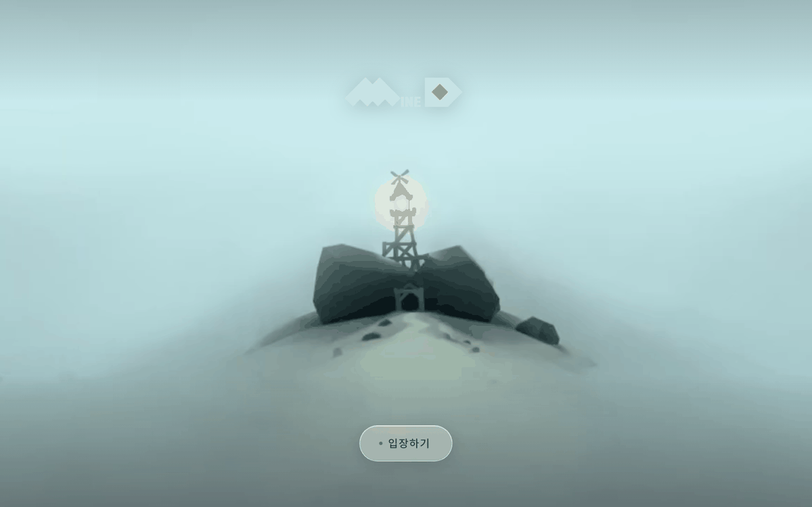
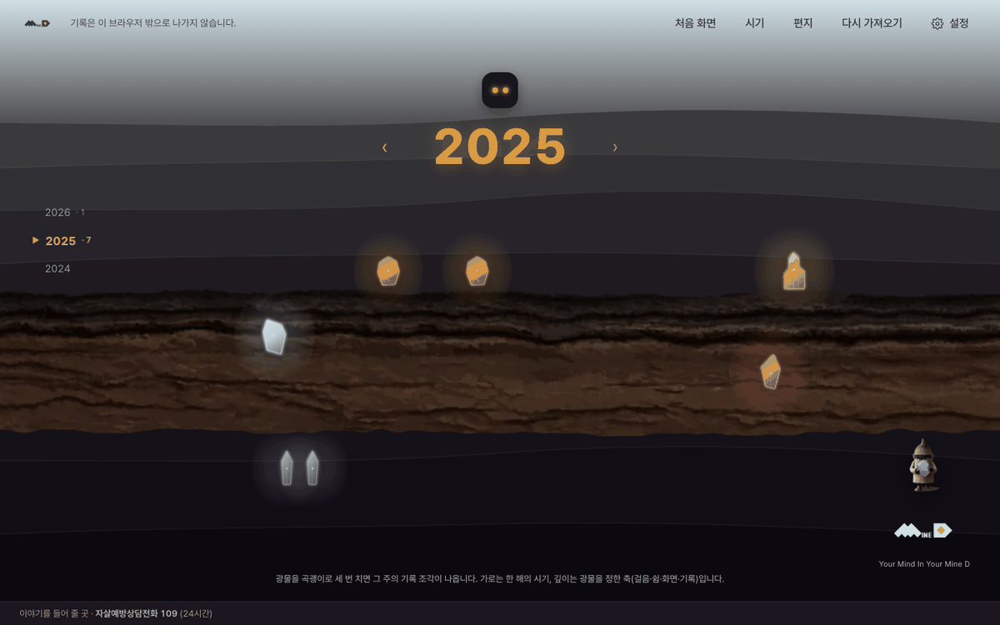

# 민디 (Mine D)

> 폰에 이미 쌓인 데이터로 과거를 되짚어, **오늘과 닮았던 시기를 찾아
> 그때의 원본을 되돌려주는** 앱.

KAIST CT×AI 콘텐츠 마이크로디그리 캡스톤 · 팀 HERIZON(1조) · Track 3 미디어아트

---

## 먼저 읽을 것

**[`docs/NOW.md`](docs/NOW.md)** — 지금 상태(10/2 갱신). 확정 사항·열린 일·낡은 문서 목록이 여기 있습니다.
정본은 코드입니다. 문서와 `pipeline/gyeol_kit/gyeol/axes.py` 가 다르면 코드가 맞습니다.

나머지 문서는 [`docs/INDEX.md`](docs/INDEX.md) 에 드라이브 원래 이름과 함께 정리했습니다.
드라이브에서 `_구버전/` 과 같은 문서의 이전 판(v1~v3 등)은 옮기지 않았습니다. 같은 이름의 문서는 가장 높은 번호만 있습니다.

---

## 지금 어디까지 왔나 (10/3)

| | 상태 | 위치 |
|---|---|---|
| 판정 파이프라인 (데이터 → 4축 → 주간 판정) | 실데이터 800주로 캘리브레이션 완료 | `pipeline/gyeol_kit/` |
| 브라우저 앱 (입장 인트로 → 민디 소개(한 화면씩) → 가져오기 → 광물 지하(3회 채굴·기록 조각) → 상세 → 민디 → 편지·나의 방) | 동작함 · 합성 데이터 검증 · 9/23 확정 규칙(스키마 v8) · 드라이브 디자인(UI 시트·8/22 랜딩) 적용 | `webapp/` · 화면 대응 [`webapp/docs/design_from_drive.md`](webapp/docs/design_from_drive.md) |
| 3개 지층 탐사 시연 | 캡스톤-06 발표용 | `app/strata_explorer_v5/` |
| XR Blocks 광석 공간 | 데스크톱 시뮬레이터 검증 | `app/xrblocks_v2/` |
| 섬 (지상 · 나만의 공간) | 설계 확정, 데모 영상 키프레임 | `docs/world/…island…`, `docs/assets/` |

---

## 저장소 구조

```
docs/       설계 문서 (NOW · 세계관 · 계획 · 디자인 · 발표) 와 디자인 이미지(docs/assets)
webapp/     브라우저 앱 — 판정 코어(Python/Pyodide) + 가져오기·화면(TypeScript)
pipeline/   gyeol_kit — 팀 판정 파이프라인 (드라이브 gyeol_kit/code, 9/12 판)
app/        발표용 프로토타입 (3개 지층 탐사 · XR Blocks)
samples/    합성 샘플 데이터와 생성기 (실제 기록 아님)
```

### 브라우저 앱 실행

```bash
cd webapp/core && uv venv --python 3.14 && uv pip install -e ".[research,synth]" pytest
.venv/bin/python ../synth/make_persona.py && .venv/bin/python ../synth/build_sample.py short
cd ../web && npm install --include=dev --legacy-peer-deps && npm run assets && npm run dev
```

자세한 내용은 [`webapp/README.md`](webapp/README.md).

 

### XR Blocks 프로토타입 (`app/xrblocks_space_prototype.html`)

v6 §5 — "광석 재료로 완성도 있는 공간을 만들 수 있는지, 확장은 어떻게 하는지" 시험용.
[XR Blocks](https://github.com/google/xrblocks)(구글 오픈소스, WebXR + three.js)를 CDN으로 불러와
광석 몇 개로 최소 공간을 만들고, 새 광석이 자동으로 바깥 링에 이어 붙는 방식을 실험합니다.

ES 모듈 임포트를 쓰기 때문에 `mined_app.html`과 달리 **`file://`로 열면 동작하지 않습니다.**
로컬 서버로 열어야 합니다:

```bash
cd app && python3 -m http.server 8080
# 브라우저에서 http://localhost:8080/xrblocks_space_prototype.html
```

인터넷 연결이 필요합니다 (three.js·XR Blocks·손 모델을 CDN에서 받아옵니다).

### 파이프라인 실행

```bash
cd pipeline/gyeol_kit
python3 run_gyeol.py                      # 리포트
python3 build_axes_json.py                # 4축 판정 JSON
python3 export_app_data.py --who "이름"     # 앱용 JSON
```

표준 라이브러리만 씁니다. 네트워크 접속 코드 없습니다. `data/` 는 각자 로컬에만 둡니다.

---

## ⚠ 절대 원칙 — 코드를 짜기 전에 읽으세요

1. **회복을 확신할 수 없으면 회복이라고 말하지 않는다**
2. **관측소(과거 데이터)에서는 판정·해석·진단하지 않는다** (섬 영역은 사용자가 건넨 단어를 AI가 잇는 것까지 허용)
3. 벌점·스트릭·화폐·상점·랜덤뽑기 없음
4. 사용자가 꾸미지 않는다 (배치·이름·연결만)
5. **AI가 안 한 일을 했다고 말하지 않는다**
6. 설명 없이 3초 안에 이해되어야 한다

「먼저 말 걸지 않는다」는 앱이 고른 것으로 먼저 말 걸지 않는다는 뜻입니다.

### 표현 금지 목록

- 임상적·진단적 언어 ("우울", "번아웃", "위험군")
- 바넘 효과식 문장 (달콤한 두루뭉술함)
- 완전한 해소·봉합으로 끝내기 — 흔적을 남긴다
- 패턴에 해석적 이름 붙이기 ("회복 사이클") — 모양만 말한다
- 좋음/나쁨 판정 — **적음/많음**으로 쓴다

---

## 🔒 개인정보 하드룰

**원본 데이터는 이 저장소에 절대 올리지 않습니다.** 이 저장소는 공개(public)입니다.

카톡 원문 · 건강 zip · 사진 · 메모 본문 · `gyeol_data.json` · `out/*.html` 은 전부 개인정보입니다.
실제 기록에서 뽑은 판정이나 사진이 들어간 데모 HTML(드라이브 `MineD_Web_Demo_v5/index.html`, `landing_0822.html` 등)도 올리지 않습니다.
`.gitignore`가 차단하고 있지만, **`git add -f`로 우회하지 마세요.**

---

## 팀

| 이름 | 맡은 것 |
|---|---|
| 김보경 | 기획·세계관·파이프라인·발표·대외 |
| 유단희 | 비주얼·팔레트·결과 선택 |
| 황하빈 | 디자인 시스템·프론트 |
| 이승현 | 3D·부스 |
| 장세희 | 리서치 |
| 안대철 (멘토) | 브라우저 통합·배포 |

## 일정

| 시점 | |
|---|---|
| 10/3 | 캡스톤-06 발표 |
| 11월 초 | 코카 전시 |
| 11/28 | 최종발표 + 수료식 |

---

## 협업 방법

[`CONTRIBUTING.md`](CONTRIBUTING.md) 참조. 브랜치를 따서 PR로 올리고, 파일 이름은 영문입니다.
