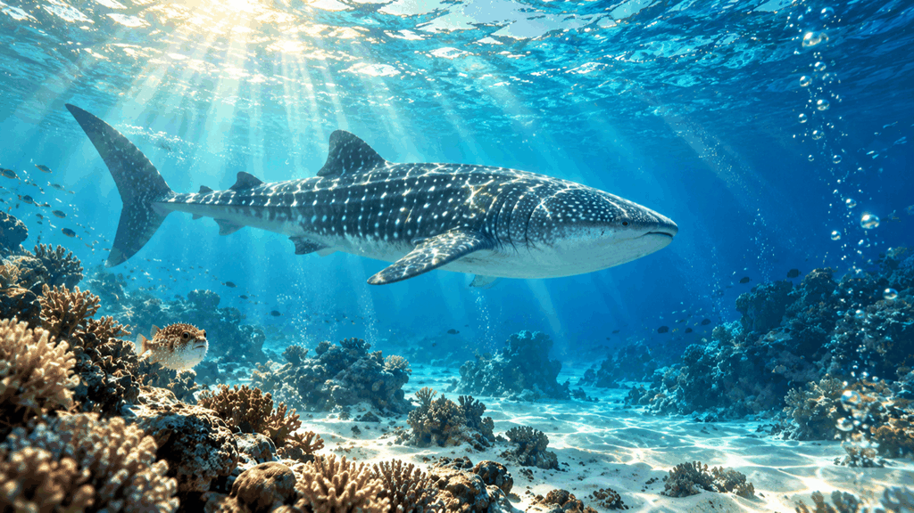

# 문서 목록

팀 드라이브(`02_프로젝트_결`)에서 10/3 기준 최신판만 옮겼습니다. 저장소 규칙에 따라 파일 이름은 영문이고, 드라이브 원래 이름을 옆에 적었습니다.

옮기지 않은 것:
- `_구버전/`, `gyeol_kit/_backup*`, 같은 문서의 이전 번호(화면문구 v1~v3, 판정설계 확정기록 v1·v2, 실행계획 v9 이전, Flow 실행표 v1~v1.6 등)
- NOW 의 「낡은 문서」 목록에 있는 것(`260826_MineD_광물9종_체계안_v1.md` 등)과 8월 결(gyeol) 시기 안내문
- 개인 기록이 들어 있는 것(`data/`, `gyeol_data.json`, `out/`, 실제 판정·사진이 박힌 데모 HTML)
- 발표 pptx·영상(용량, 실제 화면 캡처 포함) — 드라이브 `06_발표_프로토타입/` 에 있습니다
- 도구 인계서(Claude·Codex·CapCut 작업용, 개인 경로 포함)

## 지금 상태
- [`NOW.md`](NOW.md) — `00_시작하기/NOW.md` (10/2)

## world/ 세계관·화면 문구
- [`mined_doc_worldview_v2.3_260909.md`](world/mined_doc_worldview_v2.3_260909.md) — `260909_MineD_세계관설계서_v2_3.md`
- [`mined_doc_screen_wording_v4_260912.md`](world/mined_doc_screen_wording_v4_260912.md) — `260912_MineD_화면문구_규칙_v4.md`
- [`mined_doc_mineral_rules_v1_260907.md`](world/mined_doc_mineral_rules_v1_260907.md) — `260907_MineD_광물규칙_앱목적_v1.md`
- [`mined_doc_letter_structure_v1_260907.md`](world/mined_doc_letter_structure_v1_260907.md) — `260907_MineD_편지구조_개정안_v1.md`
- [`mined_doc_cross_validation_wording_v1_260909.md`](world/mined_doc_cross_validation_wording_v1_260909.md) — `260909_MineD_교차검증문구_확정안_v1.md`
- [`mined_doc_calendar_handling_v2_260909.md`](world/mined_doc_calendar_handling_v2_260909.md) — `260909_MineD_캘린더처리_확정안_v2.md`
- [`mined_doc_mindi_voice_lines_v1_260820.md`](world/mined_doc_mindi_voice_lines_v1_260820.md) — `260820_민디_보이스_대사집.md`
- [`mined_doc_mindi_voice_v1_260822.md`](world/mined_doc_mindi_voice_v1_260822.md) — `MineD_mindy_voice.md`
- [`mined_doc_mindi_llm_v2_260922.md`](world/mined_doc_mindi_llm_v2_260922.md) — `260922_MineD_민디LLM_설계_v2.md`
- [`mined_doc_island_design_v1_260927.md`](world/mined_doc_island_design_v1_260927.md) — `260927_MineD_섬설계_확정_v1.md` (「3층 구조」 표기는 10/2 용어 확정으로 「지층·광석·섬 구조」)
- [`mined_doc_screen_plan_v2_260927.md`](world/mined_doc_screen_plan_v2_260927.md) — `260927_MineD_화면플랜_정리_v2.md`
- [`mined_doc_terms_strata_ore_island_v1_261002.md`](world/mined_doc_terms_strata_ore_island_v1_261002.md) — `261002_MineD_용어확정_지층광석섬구조_v1.md`
- [`mined_doc_idea_note_island_mindi_v2_261002.md`](world/mined_doc_idea_note_island_mindi_v2_261002.md) — `261002_MineD_아이디어노트_섬과민디_v2.md`
- [`mined_doc_island_mood_reference_v1_261002.md`](world/mined_doc_island_mood_reference_v1_261002.md) — `261002_MineD_나만의공간_무드레퍼런스_분석_v1.md`

## plan/ 판정 설계·실행 계획
- [`mined_doc_progress_plan_v10_261002.md`](plan/mined_doc_progress_plan_v10_261002.md) — `261002_MineD_전체경과_실행계획_v10.md`
- [`mined_doc_judging_spec_record_v3_260915.md`](plan/mined_doc_judging_spec_record_v3_260915.md) — `260915_MineD_판정설계_확정기록_v3.md`
- [`mined_doc_space_generation_v2_260926.md`](plan/mined_doc_space_generation_v2_260926.md) — `260926_MineD_공간생성_설계_v2.md`
- [`mined_doc_workflow_v1_260924.md`](plan/mined_doc_workflow_v1_260924.md) — `260924_MineD_작업운용안_v1.md`
- [`mined_doc_mentor_gap_report_v1_260923.md`](plan/mined_doc_mentor_gap_report_v1_260923.md) — `260923_MineD_멘토보고_차이분석_요청_v1.md`

## design/ 서비스·에셋·영상 설계
- [`mined_doc_chatbot_video_xrblocks_v1_261003.md`](design/mined_doc_chatbot_video_xrblocks_v1_261003.md) — `261003_MineD_개인화챗봇_영상생성_XRBlocks_설계안_v1.md`
- [`mined_doc_identity_xrblocks_roadmap_v1_261003.md`](design/mined_doc_identity_xrblocks_roadmap_v1_261003.md) — `261003_MineD_정체성_구동_AI자동생성_XRBlocks로드맵_v1.md`
- [`mined_doc_flow_generation_table_v1.7_261003.md`](design/mined_doc_flow_generation_table_v1.7_261003.md) — `261003_MineD_Flow_반자동생성_실행표_v1.7.md`
- [`mined_doc_island_video_package_v1_261002.md`](design/mined_doc_island_video_package_v1_261002.md) — `261002_MineD_섬데모영상_제작패키지_v1.md`
- [`mined_doc_asset_list_v1_260826.md`](design/mined_doc_asset_list_v1_260826.md) — `260826_MineD_에셋리스트_추가안_v1.md`
- [`mined_doc_asset_sheet_check_v1_260906.md`](design/mined_doc_asset_sheet_check_v1_260906.md) — `260906_MineD_에셋시트_실물대조_v1.md`
- [`mined_doc_story_map_v1_260826.md`](design/mined_doc_story_map_v1_260826.md) — `260826_MineD_스토리맵_수정안_v1.md`
- 에셋 시트 원본은 드라이브 `03_에셋_디자인/Team Art Assets` 바로가기에 있습니다

## present/ 캡스톤-06 발표
- [`mined_doc_capstone06_script_v5_261003.md`](present/mined_doc_capstone06_script_v5_261003.md) — `261003_MineD_발표v7.3_수정지시_멘트v5.md`
- [`mined_doc_capstone06_speaker_notes_v1_261003.md`](present/mined_doc_capstone06_speaker_notes_v1_261003.md) — `261003_MineD_캡스톤06_발표자노트_v1.md`
- 발표본 미리보기: [`assets/capstone06_deck_v7.3_preview_261003.png`](assets/capstone06_deck_v7.3_preview_261003.png) (pptx 는 드라이브 `06_발표_프로토타입/261003_MineD_캡스톤06_발표_v7.3.pptx`)

## guide/
- [`mined_doc_make_my_data_v1_260819.md`](guide/mined_doc_make_my_data_v1_260819.md) — `결_내_데이터_만들기.md` (내보내기 파일 받는 법)

## assets/ 디자인 이미지 (가로 1024px로 줄임)
- `island_demo_K1~K4` — `261002_MineD_섬데모_K1~K4_v1.png`
- `keyframe_C01~C10` — `261003_MineD_C01~C10_…_16x9` (C01 은 v2)

   

